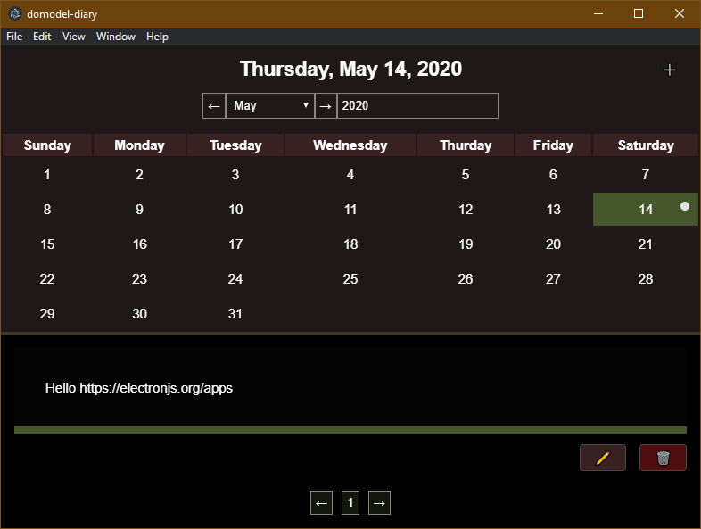

# domodel-diary-electron [](https://gitpod.io/#https://github.com/thoughtsunificator/domodel-diary-electron) 

A small diary application made with [domodel](https://github.com/thoughtsunificator/domodel)



- Calendar
- Daily notes encrypted using AES
- Password Protected

If you can't find the release for your machine you have to build if yourself by following the instructions below.

## Getting started

### Installing

Clone the repository along with its submodules:

```git clone --recurse-submodules https://github.com/thoughtsunificator/domodel-diary-electron.git```

### Launch it

- npm install
- npm start

### Build

- npm install
- npm run dist

The binaries are available in the ``dist/`` folder.